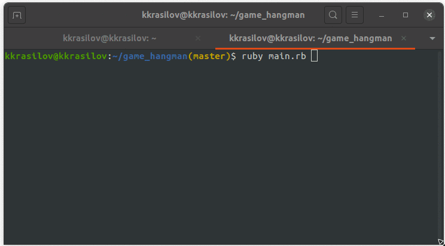

# Game "Hangman"

## Об игре

Игра "Hangman" основана на популярной игре "Виселица". Игрок угадывает буквы, чтобы раскрыть скрытое слово. 
Подробнее об игре можно узнать из [википедии](https://ru.wikipedia.org/wiki/Виселица_(игра)).  

## Preview



## Правила игры

Игра загадывает случайное слово и выводит количесвто букв на экран.  
Игрок вводит буквы в терминал.  
Если игрок указывает неверную букву (ошибся), то на экране рисуется деталь виселицы.  
Если игрок не успеет угадать слово раньше, чем допустит 7 ошибок, виселица появится полностью игрок проиграет.

*Отличная стратегия игры — начинать с гласных букв. Даже если вы не знаете загаданное слово, можете интуитивно угадать по звучанию 
или догадаться с нескольких попыток. ;)*

## Добавление своих слов в игру

Вы можете добавлять свои слова в игру. 
Для этого вставтье новое слово в конец файла word.txt в папке date.  
Каждое новое слово надо начинать с новой строки.  
Одна строка - одно слово.  

*Согласно традиции русских лингвистических игр, слово должно быть именем существительным, 
нарицательным в именительном падеже единственного числа, либо множественного числа при отсутствии у слова формы единственного числа.*

## Установка

Для корректной работы программы на вашем компьютере должен быть установлен [Ruby MRI](https://www.ruby-lang.org/en/).

```
$ git clone https://github.com/kkrasilov/game_hangman.git
$ cd ./game_hangman
$ bundle
```

## Запуск

Запуск осуществляется командой

```
$ bundle exec ruby main.rb
```
